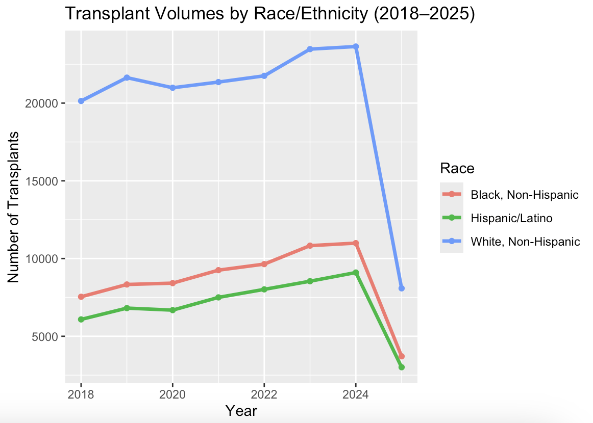
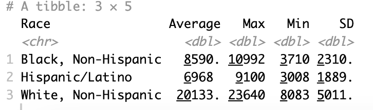
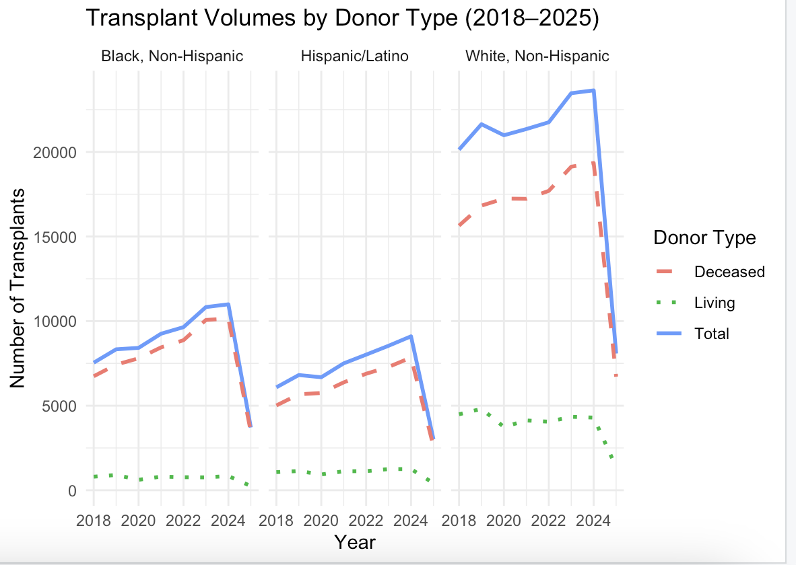
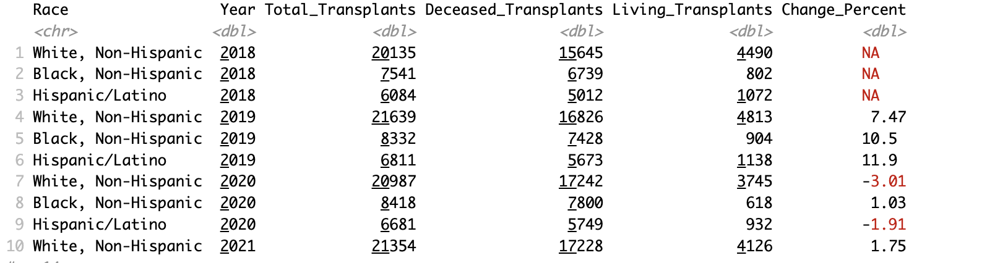

# Transplant Volumes and Racial Disparities: A Data Analysis of U.S. Organ Allocation (2018–2025)

**By:** Sumaiya Tasnim
**Saint Peter's University — DS-399-IS, Dr. Gulhan Bizel**
**August 2025**

📄 [Read the full paper](Racial%20Disparities%20In%20Transplants%20In%20The%20United%20States%20.pdf)

## Overview
Organ transplantation is a critical, life-saving procedure for individuals with end-stage organ failure, yet persistent disparities continue to shape who receives a transplant and who does not. By mid-2025, more than 103,000 people were waiting for a transplant, and on average 13 people die each day while waiting for an organ. This project analyzes U.S. organ transplant data from 2018–2025 to examine changes in transplant volumes, the distribution of living versus deceased donor transplants, and patterns among patients on the waiting list — aiming to highlight inequities in transplant access across race and ethnicity.

## Introduction
Becoming an organ donor requires meeting multiple criteria, including age, medical history, and family history, and further testing is needed to ensure a recipient's body will accept the organ rather than reject it. In some cases, race and ethnicity are considered during matching, as genetic and immunologic factors can influence compatibility. While sharing the same ethnicity is not required for donor–recipient matching, having a larger and more diverse donor registry improves the chances of finding a suitable match for everyone on the waiting list.

Prior research has documented differences in transplant access by race, ethnicity, age, and donor type, but many of these disparities remain poorly understood when examined over time and across populations. This study uses data from 2018 to 2025 to examine transplant volume trends, donor type distribution, and waiting list patterns, aiming to better understand who is waiting, who receives transplants, and how these trends have evolved.

## Data
- **Input file:** `Capstone.csv` (not included in this repo — add your own copy locally to run the script)
- Publicly available U.S. transplant registry data (OPTN/UNOS-style reporting) covering 2018–2025, including transplant volumes by race/ethnicity, donor type (living or deceased), patient age groups, and waiting list size.

## Methods
Data cleaning and preparation were completed in R Studio, where raw tables were transformed into tidy data frames for analysis:

1. **Data wrangling:** Extract relevant rows/columns for race and age-group breakdowns, clean numeric formatting (e.g., remove commas), and reshape from wide to long format using `tidyr::pivot_longer`.
2. **Donor type analysis:** Join total and deceased-donor transplant data to derive living-donor transplant counts.
3. **Descriptive statistics:** Averages, maximums, minimums, and standard deviations of transplant counts across racial and ethnic groups.
4. **Trend analysis:** Year-over-year percentage changes (via `mutate`) and each group's share of total transplants per year.
5. **Visualization:** `ggplot2` line plots, faceted plots, and summary charts showing transplant activity by year, donor type, and race/ethnicity.

Waiting list data was also summarized and compared against actual transplant rates to highlight mismatches between supply and demand.

## Packages Used
`tidyverse` (`dplyr`, `tidyr`, `ggplot2`)

## Results

Between 2018 and 2024, transplant volumes increased steadily across all racial and ethnic groups. However, 2025 saw a sudden, significant drop across all groups — likely due to incomplete data for the still-ongoing year rather than a genuine reversal of the trend. A smaller dip in 2020 likely reflects COVID-19 pandemic disruptions to elective and transplant surgeries.

**Figure 1.** Transplant volumes by race from 2018 to 2025. All groups experienced steady growth in transplant numbers until a noticeable drop in 2025.

Throughout the study period, a clear and consistent disparity emerged across racial and ethnic groups. White, Non-Hispanic patients received the highest number of transplants each year, averaging approximately **20,133** transplants annually, compared to **8,590** for Black, Non-Hispanic patients and **6,968** for Hispanic/Latino patients. White patients also showed the highest year-to-year variability (SD = 5,011), while Black and Hispanic/Latino patients had both lower and less variable transplant counts — suggesting more rigid, consistent barriers to access.

**Figure 2.** Statistical summary of transplant counts by race and ethnicity, showing the average, maximum, minimum, and variability over the study period.

Across all groups, the majority of transplants relied on deceased donors, most notably among White, Non-Hispanic patients (~16,228/year on average — nearly double Black and Hispanic/Latino patients). The gap was even wider for living donor transplants: White patients averaged 3,905 living-donor transplants per year, versus just 719 for Black patients and 1,040 for Hispanic/Latino patients — a disparity that may reflect socioeconomic barriers, reduced access to donor networks, healthcare education gaps, or mistrust in the medical system.

**Figure 3.** Breakdown of transplants by donor type (deceased vs. living) and race/ethnicity between 2018 and 2025. Deceased donors accounted for the majority of transplants across all groups.

White, Non-Hispanic patients consistently accounted for the largest share of total transplants each year, despite Black and Hispanic/Latino patients making up a significant portion of the waiting list — pointing to systemic issues in organ allocation rather than population differences alone.

**Figure 4.** Yearly transplant totals, donor type breakdown, and year-over-year percent change by race.

As of September 2024, the largest segment of the national waiting list was adults aged 50–64 (43,829 people), followed by those 65+ (26,460); patients under 18 made up fewer than 1,000. By race/ethnicity (2023 data), the waiting list was led by White patients (40,476), followed by Black patients (28,552) and Hispanic/Latino patients (23,757) — yet Black and Hispanic patients' actual transplant rates remained disproportionately low relative to their share of the waiting list.

## Discussion
From 2018 through 2024, transplant volumes increased for all major groups — a promising trend on the surface. But White, Non-Hispanic patients consistently received far more transplants than Black and Hispanic/Latino patients every year, a gap too large and persistent to be explained by population size or health needs alone. This points to structural barriers shaping who gets access to life-saving care.

Donor type compounds the disparity: White, Non-Hispanic patients received nearly four times as many living-donor transplants as Black or Hispanic/Latino patients. Living-donor transplants tend to offer better outcomes and shorter wait times, making this gap especially consequential. The low numbers for Black and Hispanic patients likely reflect systemic challenges — lower rates of health insurance and transplant education access, financial hardship, and higher likelihood of disqualifying health conditions within close family networks — rather than a lack of willingness to donate.

The sharp 2025 decline across all groups is most plausibly explained by incomplete data collection or reporting delays for a year still in progress, underscoring the importance of interpreting recent-year data cautiously and looking at multi-year trends rather than any single year.

## Conclusion
This study reinforces what the data makes undeniable: access to organ transplantation in the U.S. remains unequal. While transplant volumes have increased overall, the distribution continues to favor White, Non-Hispanic patients in both deceased- and living-donor cases, while Black and Hispanic/Latino patients — despite comprising a large share of the waiting list — consistently receive fewer transplants. Closing this gap requires more than adding donors to the system; it requires addressing the barriers tied to education, economics, systemic bias, and unequal access to care — shifting from awareness to accountability, and from data collection to equity-driven change.

## How to Run
1. Open `Capstone R Coding.R` in RStudio.
2. Place `Capstone.csv` in the working directory.
3. Run the script top to bottom to reproduce the visualizations and summary tables.

## Note
Row indices used to extract race and age-group data are based on manual inspection of the source file's layout — if using a differently formatted transplant dataset, these indices will need to be adjusted.

## References
- Detailed Description of Data | organdonor.gov. (2024, October 17). Organ Donation. https://www.organdonor.gov/learn/organ-donation-statistics/detailed-description#fig1
- Detailed Description of Data | organdonor.gov. (2024, October 17). Organ Donation. https://www.organdonor.gov/learn/organ-donation-statistics/detailed-description#fig2
- Organ Transplants and Black/African Americans | Office of Minority Health. (2025, February 13). https://minorityhealth.hhs.gov/organ-transplants-and-blackafrican-americans
- Racial and ethnic disparities on the heart transplant waiting list. (2025, March 15). PubMed. https://pubmed.ncbi.nlm.nih.gov/39814184/
